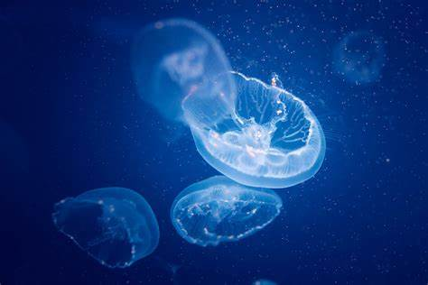
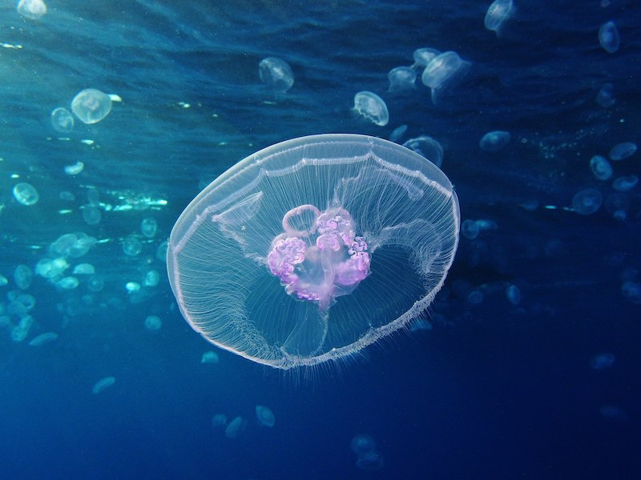

# xluo0231-9103-tut06
## **Creative coding major project**
#### **Description of interaction with the work**
This work allows users to interact in the following ways:

1. **Mouse interaction**: When the user moves the mouse over the screen and clicks on the center of the jellyfish, the jellyfish will bloom. The animation effect simulates the floating movement of jellyfish, creating a more vivid underwater scene.

2. **Keyboard interaction**: When you press the space bar, bubbles floating slowly upward will be generated on the screen, simulating the floating effect of jellyfish in the ocean. The bubble will reset once it reaches the top and start floating again from the bottom of the screen.

3. **Clear effect**: When the "C" key is pressed, the bubbles on the screen will be immediately emptied and the status of all bubbles will be reset.

#### **A personal way to animate your code**
I selected the user input to drive the animation in the code. With mouse clicks and keyboard keys, users can trigger different animations, such as the blooming of jellyfish and the formation and floating of bubbles.

#### **Animation processing of image properties**
In some of my code, the main image properties for animation processing include:

**Jellyfish**: Make the flowers in the original team code look more like jellyfish by adding translucent round elements. I bind the expansion effect of the jellyfish part to the mouse click event, and the jellyfish will expand quickly after clicking.

**Bubbles**: I created an array of bubbles to manage the state of each bubble. The bubbles float slowly upward depending on the time, and when they reach the top, they reset and regenerate from the bottom of the screen. This motion is controlled by a simple displacement function.

#### **The difference between me and the rest of the group**
What makes my work different from other group members is that I focus on interactive design, especially in terms of interaction with the mouse and keyboard. I added action elements in the animation, such as float and drift, which were different from the color changes or the way the components were displayed in the other crew members.

#### **Source of inspiration**
My code was redesigned from the original painting, inspired by jellyfish and the Marine environment, especially the dynamic visuals of jellyfish floating and expanding. I looked up some images and movements of jellyfish, which visually provided me with inspiration for design and animation. These images show the way jellyfish float, expand and move, and I hope to simulate similar dynamic effects through code to increase the immersion of the work.

#### **Technical instructions for animation effects**
I used user input as the primary driver. By listening for keyboard and mouse events, I can trigger animations of jellyfish blooms and bubbles. Bubbles float upward by simply updating frame by frame, using a gradual change in the y coordinate. All animation effects are controlled through frameCount so that they move smoothly over time.

#### **Code change specification**
In some of my code, I made a lot of changes to the animation effects. First, change the overall color scheme and background color to a gradient of blue. The original code didn't have the ability to dynamically generate and move bubbles, so I added an array of bubbles and cyclically updated the coordinates of each bubble to make it appear to float upward. In addition, I also changed the way the flowers are displayed to make it more in line with the jellyfish visual effect.

#### **Technical source**
Using the p5.js library, it is a tool that simplifies graphics and animation processing, can easily achieve interaction and animation effects, and supports real-time interaction simple and easy to operate.